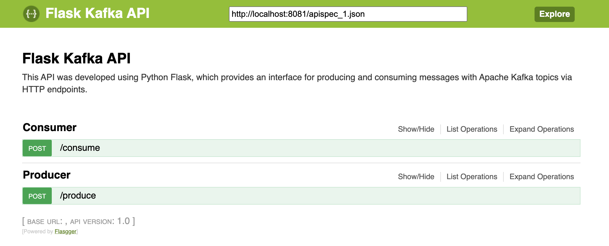

# Kafka Tutorial
Kafka is a distributed streaming platform to enables communication among producers and consumers in publish-subscribe messaging to deal with huge volumes of real-time data stream. In this tutorial, we provided the docker-compose.yml file to build, run, and test locally by assuming you have knowledge of using Docker and Docker Compose.

## Pre-requisites
Building the docker-compose.yml file requires installing the [Docker engine](https://docs.docker.com/engine/install/) and [Docker Compose](https://docs.docker.com/compose/install/).

### Installation
* Clone this repository to create a local copy on your computer.
* Open a terminal and `cd` to kafka-tutorial/docker-and-compose folder in which `docker-compose.yml` is saved and run:

```bash
docker-compose up -d
```

### Interacting with Kafka containers from your computer

Checking docker containers currently run executes the following command:

```bash
docker ps | grep -e kafka -e zookeeper
```

Creating a Kafka topic runs the following command:

```bash
docker-compose exec kafka kafka-topics.sh --create --bootstrap-server \
    localhost:9092 --replication-factor 1 --partitions 1 --topic hello-kafka
```

Listing Kafka topics runs the following command:

```bash
docker-compose exec kafka kafka-topics.sh --list --bootstrap-server localhost:9092
```

Sending messages to Kafka topics uses the following command:

```bash
docker-compose exec kafka kafka-console-producer.sh --broker-list \
  localhost:9092 --topic hello-kafka
```

Consuming messages from Kafka topics runs the following command:

```bash
docker-compose exec kafka kafka-console-consumer.sh --bootstrap-server \
  localhost:9092 --topic hello-kafka --from-beginning
```

Stopping Kafka containers runs the following command:

```bash
docker-compose down
```
<br />

# Building Python Flask to pull the live stream data from Apache Kafka
The flask-kafka project was developed to publish and subscribe from Kafka topics by exposing services as REST-API. There are several Python libraries to interact with Kafka, e.g., [confluent-kafka](https://docs.confluent.io/kafka-clients/python/current/overview.html), [kafka-python](https://kafka-python.readthedocs.io/en/master/), [aiokafka](https://aiokafka.readthedocs.io/en/stable/). In this project, we used confluent-kafka, which provides the producer, consumer, and admin operations with a high-performance Python client for Apache Kafka.

## Pre-requisites
Building the docker-compose.yml file requires installing the [Docker engine](https://docs.docker.com/engine/install/) and [Docker Compose](https://docs.docker.com/compose/install/).

### Installation
* Clone this repository to create a local copy on your computer.
* Open a terminal and `cd` to kafka-tutorial/flask-kafka folder in which `docker-compose.yml` is saved and run:

```bash
docker-compose up --build
```

### Interacting with Kafka containers through the flask-kafka project

Checking docker containers currently run executes the following command:

```bash
docker ps | grep -e kafka
```

In addition, the flask-kafka project provides Swagger UI for testing interaction with Apache Kafka. To begin with, open the browser and type a URL [http://localhost:8081/apidocs](http://localhost:8081/apidocs).

This API enables two services:
* Consumer: This service allows retrieving a message from a specific Kafka topic.
* Producer: This service allows pushing a message to a specific Kafka topic.
<br /><br />



<div dir='rtl'>(: Have fun and happy coding</div># softArch-kafka-exercise

# ----------------------------
Krafka topic can be `Italian, Japanese, Chinese, Thai, Indian` <br>
Kafka group_id can be `Kitchen 1, Kitchen 2, Kitchen 3, Kitchen 4` <br>